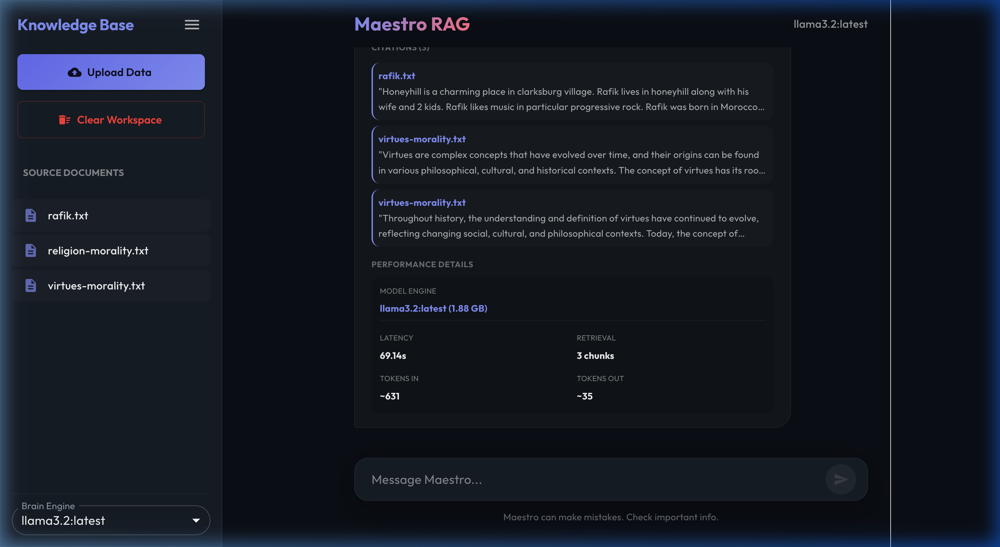

# Maestro RAG - Personal Assistant

Maestro RAG is a professional-grade retrieval-augmented generation (RAG) assistant that allows you to chat with your own documents using local LLMs via Ollama. It features a modern interface with advanced hybrid search, AI re-ranking, and session-based chat history.



## 🚀 Advanced Intelligence & Optimization

Maestro now includes a multi-stage retrieval pipeline designed to maximize accuracy even with smaller local models (1B/3B):

1.  **Hybrid Search (Vector + BM25)**: Combines semantic "meaning" search with traditional "keyword" matching. This ensures that technical terms, names, and exact phrases are never missed, while still understanding the general intent of your question.
2.  **FlashRank Re-ranking**: After retrieving potential matches, a local, ultra-fast re-ranking model evaluates each chunk for "deep" relevance. It trims the noise and passes only the absolute best context to the LLM.
3.  **Cross-Model Consistency**: Uses a dedicated embedding model (`nomic-embed-text`) so you can switch your chat model (e.g., from Llama to Gemma) without ever having to re-index your documents.

## Features

- **Local RAG**: Chat with your PDFs, text files, and markdown documents locally.
- **Chat History & Sessions**: Track multiple conversations with timestamped session threads. Load previous chats or start fresh threads with a single click.
- **Citations & Sources**: Collapsible sections listing the specific source documents and text snippets used to generate every answer.
- **Performance Tracking**: Built-in metrics including latency, model engine + size, context retrieval chunks, and token counts (In/Out).
- **Streaming Responses**: Real-time, token-by-token responses like ChatGPT.
- **Document Management**: Easily upload, list, and delete documents from your knowledge base.

## Prerequisites

- **Python 3.10+**
- **Node.js 18+**
- **Ollama**: [Download and install Ollama](https://ollama.com/)

## Installation

### 1. Ollama Setup

Ensure Ollama is running and you have the required models:
```bash
ollama pull llama3.2
ollama pull nomic-embed-text  # Required for consistent embeddings
```

### 2. Backend Setup

```bash
cd backend
python3 -m venv venv
source venv/bin/activate
pip install -r requirements.txt
```

### 3. Frontend Setup

```bash
cd frontend
npm install
```

## Usage

### 1. Start the Backend

```bash
cd backend
source venv/bin/activate
python3 main.py
```
The API will be available at `http://localhost:8000`.

### 2. Start the Frontend

```bash
cd frontend
npm run dev
```
The application will be available at `http://localhost:5173`.

### 3. PDF to Markdown Utility

To speed up processing of large PDFs, convert them to Markdown first:
```bash
python3 pdf_to_md.py <path_to_pdf> -o <output_path.md>
```

## How it works

1.  **Ingestion**: Documents are chunked and converted into vector embeddings using `nomic-embed-text`.
2.  **Retrieval**: When you ask a question, Maestro performs a **Hybrid Search** (Vector + Keyword) to find potential answers.
3.  **Refinement**: The top candidates are passed to a **FlashRank Re-ranker** that identifies the most relevant context.
4.  **Generation**: The refined context is passed to your selected Ollama model along with your **Chat History** to generate a grounded, conversational answer.
